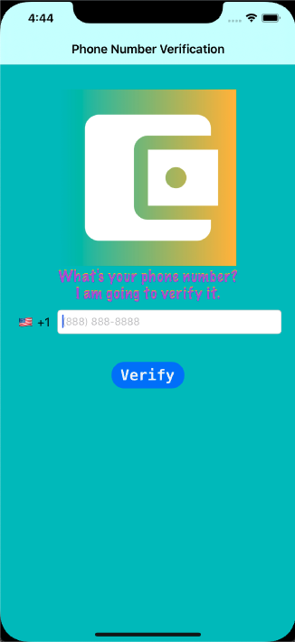
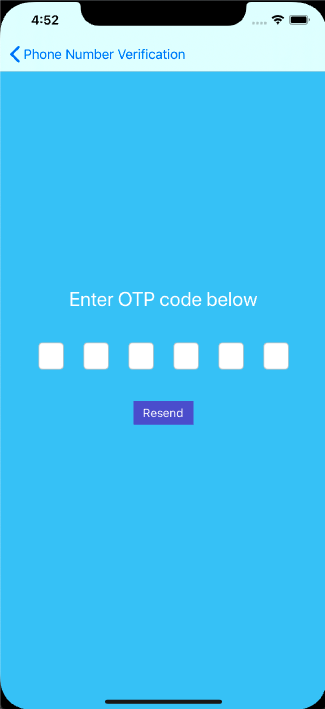
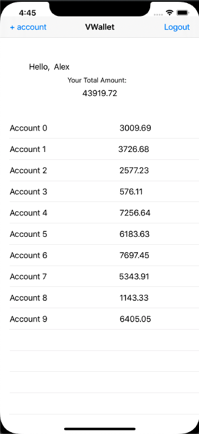
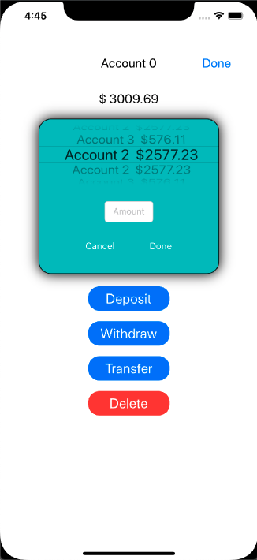
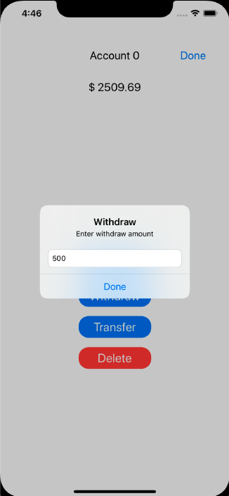
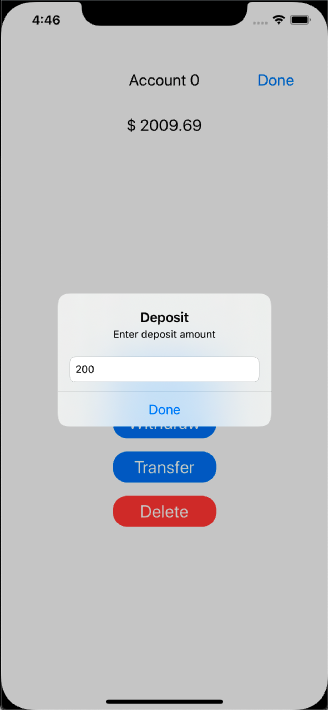

# VWallet
<b> iOS wallet app with phone number and OTP code verification <b/>

1) Install the latest Xcode and run the file VWallet.xcworkspace:

2) Type in your valid phone number and click verify

If your phone number is correct, you will receive a text message with your One Time Password code.

You will need to do this OTP verification process only once. 

3) Your initial accounts will be generated randomly:

4) Customize and control your accounts:

